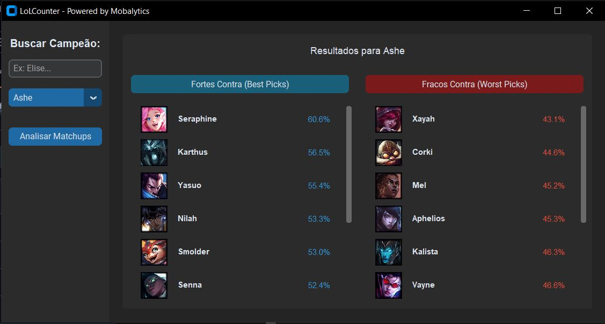
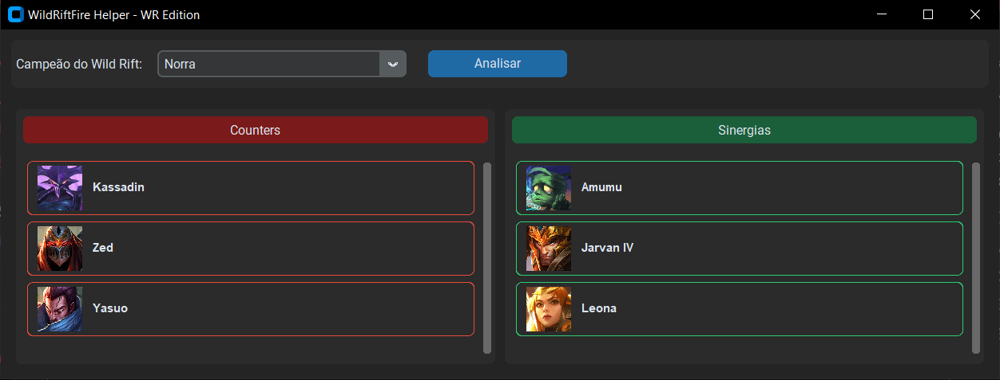

# LoL & Wild Rift Counter Search

Este repositório contém dois scripts independentes em Python para consulta automatizada de *matchups* (counters e sinergias) para League of Legends (PC) e Wild Rift (Mobile). As ferramentas utilizam técnicas de web scraping para extrair dados atualizados diretamente de plataformas de referência.

<details open>
  <summary>Aba de Prints</summary>
  
  <br>

  ### 🖥️ League of Legends Counters - Mobalytics + lol db
  
  
  ---
  
  ### 📱 Wild Counters - Wild Rift Fire + loldb
  

</details>

## 🚀 Funcionalidades

- **LoLCounter.py**: Consulta counters e win rates para League of Legends PC via Mobalytics.
- **WildCounter.py**: Consulta counters e sinergias para Wild Rift via WildRiftFire.
- **Interface Gráfica**: Construída com `customtkinter` para uma experiência moderna e intuitiva.
- **Sincronização Dinâmica**: Lista de campeões atualizada via Riot Data Dragon (API oficial).

## 🛠️ Tecnologias

- **Python 3.x**
- **CustomTkinter**: Interface de usuário (GUI).
- **BeautifulSoup4**: Extração de dados HTML.
- **Requests**: Comunicação HTTP.
- **Pillow (PIL)**: Renderização de ícones dos campeões.

## 📦 Instalação

Para Utilizar a distribuição oficial do CPython: https://www.python.org/downloads/
Clone o repositório e instale as dependências necessárias, use o comando ou se preferir opte pelo .bat instalar_dependencias:

## Como Rodar o Script:
- **launcher.bat**: Certifique de ter instalado o Python3 e as dependências do script, coloque o script.py na mesma pasta em que o launcher.bat correspondente (Ex: LolCounter.py e lolcounter.bat), abra o launcher 'lolcounter.bat'.


```bash
pip install customtkinter requests beautifulsoup4 pillow


